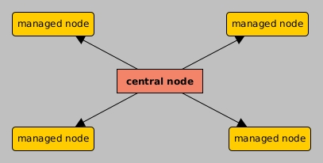

# Ansible
These are my notes for DevOps stuffs. I will include info from the following courses
- <span style="color:aquamarine">Getting Started with Ansible</span>, by Wes Higbee, **pluralsight**.
- <span style="color:aquamarine">Ansible and DevOps Integrations: The Big Picture</span>. by Saravanan Dhandapani, **pluralsight**
- <span style="color:aquamarine">Practical Ansible 2, Automate infrastructure, manage configuration, and deploy applications with Ansible 2.9</span>
, by Daniel Oh, James Freeman and Fabio Alessandro Locati. Book


Ansible is an automation tool, similar to Chef, Puppet and SaltStack. In <b>enterprise environments</b>, it is used to:
1. Automatize pipelines in a reliable way.
2. Automatize configuration of any environment: VMs, containers, pods, etc.
3. Aid in build and deploys tools, with other tools such as Jenkins
4. Abstract the communication with all the environments it can work with: VMs, containers, etc

Ansible can communicate with and manage the following type of nodes, or environments, which normally are remote:
1. VMs, Linux and Windows type
2. bare metal servers, Linux and Windows
3. containers, docker
3. pods, Kubernetes

To work with this environments, Ansible use the so called <i>plugins</i> and <i>modules</i>, which are very well written and tested Python scripts, or applications. Plugins run in the control node, while modules run in the managed nodes.

We can think of different degrees of automation: bash scripts, Ansible adhoc commands, Ansible playbooks.

A bash script is <b>imperative</b>, as we must explicitly specify what we want to do in order to achieve a <u>desired state</u>; we most specify the <i>how</i> and adapt it to the <u>initial state</u> we have. 

Ansible is <b>declarative</b>, as we only must specify the desired state. This let us focus in our goal, Ansible will take care of the <i>how</i> !

## Install Ansible 
Ansible is a <b>Python</b> app. We install it with
```shell
$ pip list --outdated
$ pip install -U ansible
$ ansible --version
ansible [core 2.12.2]
  config file = None
  configured module search path = ['/home/camilo/.ansible/plugins/modules', '/usr/share/ansible/plugins/modules']
  ansible python module location = /home/camilo/.local/lib/python3.8/site-packages/ansible
  ansible collection location = /home/camilo/.ansible/collections:/usr/share/ansible/collections
  executable location = /home/camilo/.local/bin/ansible
  python version = 3.8.10 (default, Mar 15 2022, 12:22:08) [GCC 9.4.0]
  jinja version = 3.0.3
  libyaml = True
```
We can see all the different <u>Ansible commands</u> we have installed. All of them support the <code>-h</code> option. 
```shell
$ ansible //+ \tab
ansible             ansible-connection  ansible-doc         ansible-inventory   ansible-pull        ansible-vault       
ansible-config      ansible-console     ansible-galaxy      ansible-playbook    ansible-test
$ ansible -h
usage: ansible [-h] [--version] ...
...
Define and run a single task 'playbook' against a set of hosts

positional arguments:
  pattern               host pattern
...
```

## Ansible architecture
Ansible has a centralized architecture. Only the central node must have Ansible installed. All nodes, central and managed, must have a Python interpreter installed, and ansible must know where it is.



## Ansible plugins
Ansible plugins augment Ansible's core functionalities. Plugins run in the control node within the Ansible process.
Plugins are divided in the following <u>categories</u> (as of 2020)
- <b>become</b>: Responsible for enabling Ansible to obtain super-user access (for example, through sudo). See  https://docs.ansible.com/ansible/latest/user_guide/become.html. Don't know how to use it.
- cache: Responsible for caching facts (like system properties) retrieved from backend systems to improve automation performance
- callback: Allows you to add new behaviors when responding to events —for example, changing the format data is printed out in the output of an Ansible
playbook run.
- cliconf: Provides abstractions to the command-line interfaces of various network devices, giving Ansible a standard interface to operate on.
- <b>connection</b>: Provides connectivity from Ansible to remote systems (for example, over SSH, WinRM, Docker, and many more)
- httpapi: Tells Ansible how to interact with a remote system's API (for example, for a Fortinet firewall)
- <b>inventory</b>: Provides Ansible with the ability to parse various static and dynamic inventory formats.
- lookup: Allows Ansible to look up data from an external source (for example, by reading a flat text file)
- <b>module</b>: another type of Ansible plugin ...
- netconf: Provides Ansible with abstractions to enable it to work with NETCONF-enabled networking devices.
- shell: Provides Ansible with the ability to work with various shells on different systems (for example, powershell on Windows versus sh on Linux)
- strategy: Provides plugins to Ansible with different execution strategies (for example, the debug strategy, Playbooks and Roles)
- vars: Provides Ansible with the ability to source variables from certain sources, such as the host_vars and group_vars directories,
Defining Your Inventory)

We can list all the installed plugins under one category with
```shell
$ ansible-doc -t connection -l  // list all plugins of type 'connection'
[WARNING]: Collection ibm.qradar does not support Ansible version 2.12.2
[WARNING]: Collection splunk.es does not support Ansible version 2.12.2
[WARNING]: Collection frr.frr does not support Ansible version 2.12.2
ansible.netcommon.httpapi      Use httpapi to run command on network appliances                                                                                                          
ansible.netcommon.libssh       (Tech preview) Run tasks using libssh for ssh connection                                                                                                  
ansible.netcommon.napalm       Provides persistent connection using NAPALM                                                                                                               
ansible.netcommon.netconf      Provides a persistent connection using the netconf protocol                                                                                               
ansible.netcommon.network_cli  Use network_cli to run command on network appliances                                                                                                      
ansible.netcommon.persistent   Use a persistent unix socket for connection                                                                                                               
community.aws.aws_ssm          execute via AWS Systems Manager 
...
```
We can get help about an specific plugin in one category with
```shell
$ ansible-doc -t connections ssh // get help about the connection plugin 'ssh'
```

## Ansible adhoc command
The example:
```shell
$ ansible -m copy -a "src=master.gitconfig dest=~/.gitconfig" [--check] [--diff] localhost
```
is an example of Ansible adhoc command using the Ansible module <code>copy</code>. One of the most common options used with it are:

 -C, --check &emsp;         dry-run. Don't make any changes; instead, try to predict some of the changes that may occur  
 -D, --diff  &emsp;        when changing (small) files and templates, show the differences in those files; works great with --check
-v, -vv, -vvv  &emsp;  use for different levels of verbosity

## Ansible modules
A module is a type of plugin. Ansible modules are well made and tested Python scripts designed to accomplish a set of operations in a given domain-of-things, for example the <code>copy</code> module. Modules execute in the managed nodes:
```shell
$ ansible-doc -t module -l
$ ansible-doc copy  //equivalent to "ansible-doc -t module copy", get help about the 'copy' module
```

With the Ansible adhoc command we can use the <code>copy</code> module as
```shell
$ ansible -m copy -a "src=master.gitconfig dest=~/.gitconfig" localhost
$ ansible -m homebrew -a "name=bat state=latest" localhost // install the "bat" command, latest version in localhost (desired stated)
```
Here we target "localhost".

In the example above the <u>desired state</u> is to have the specific source file in the specific destination file. Ansible will achieve this desired state whatever the <u>initial conditions</u> are:
- destination file exists and is identical (sha1) -> nothing will be done
- destination file exists but is different -> the source file will be copied to the destination file
- destination file does not exits -> the source file will be copied to the destination file

The <code>copy</code> module is an example of <u>idenpotent</u> module. It will give the same result regardless the number of re-runs.
Not all Ansible modules are idenpotent. For example, <code>comand</code> and <code>debug</code> are not; they don't ensure any specific state, they just show something.

Ansible modules are normally called inside task of Ansible <u>playbooks</u>. Normally, Ansible modules will return something, either we execute them with the Ansible adhoc command or in a playbook. See the documentation. They will return a json we can see using the  <code>-v</code> option.

```shell
$ ansible-playbook mySimplePlaybook.yml -v
```

Ansible modules are Python scripts. Therefore, in order to be run in a given node, the node must have a Python interpreter installed, and the node configuration must specify where it is. Otherwise Ansible will try to find it in some default location.  In an ini host definition for the node "localhost" we can set
```text
# ini format for configuring access to localhost as a target 
localhost ansible_connection="local" ansible_python_interpreter="/usr/local/bin/python3"
``` 


## Ansible playbooks
Ansible modules are meant to be used in Ansible playbooks, not in Ansible adhoc commands. Ansible adhoc commands are more inefficient, as each time one is executed it's gathered information about the system, for example. In a playbook the information is only gathered once.

```bash
# mySimplePlaybook.yml
- name: Play number 1  ## a play
  hosts: localhost  ## ?? parameter
  tasks:                              ## list of tasks
  - name: run the copy module         ## name of the task
    copy: src="~/t1/file.txt" dest="~/t2"  ## module or action

  - name: run the copy module again
    copy:                           ## module or action?
      src: "~/t1/file.txt"       ## arg
      dest: "~/t2"               ## arg
      follow: yes                ## arg

- name: Play number 2
  hosts: localhost
  gather_facts: false  ## ?? parameter
  tasks:  
    - name: git_config module simplifies listing configuration 
      git_config: list_all=yes scope=global
```

In general a playbook has a set of plays, each with a name, and each play has a 'tasks' field. Under the tasks field we specify different named tasks (or actions). A task can be a call to a module, buy may be something else, it seems. We execute a playbook with the <code>ansible-playbook</code> command:
```shell
$ ansible-playbook mySimplePlaybook.yml [-v, -vvv, --diff, --check]
```

Each play in a playbook will run the "Gathering Facts" task by default as the first one, which gather info about all the nodes Ansible has discovered at the time the playbook is run (nodes in the inventory being used). This task runs the <code>setup</code> module, (<code>$ ansible-doc setup</code>). To disable it use the parameter <code>gather_facts: false</code> at play level.

```shell
$ ansible -m setup localhost
$ ansible all -m ansible.builtin.setup --tree /tmp/facts # Display facts from all hosts and store them indexed by I(hostname) at C(/tmp/facts).
```

Task of a play may need these facts, so we may encounter some problems if we disable it. We can filter out an specific fact we are interested in about the hosts in our inventory. For example, suppose we want to know the package manager that will be used by each node; we would do:
```shell
$ ansible -m setup -a "filter=ansible_pkg_mgr" all  ## consider all nodes in the inventory
```

Ansible playbooks must follow strict yml formatting rules. See yaml.org

### tags

Tags in a playbook are used to limit the set of task of plays we execute from a playbook, when we call it with <code>ansible-playbook -t</code>. For example, see the following play tagged with <code>[  'install-git'  ]</code>:
```shell
- name: Ensure git is installed
  hosts: centos  ## a group of hosts
  tags: [  'install-git'  ]
  tasks:
    - package: name=git state=latest          ## 'git' is a valid package name for a centos environment, check it!
      when: ansible_os_family == 'RedHat'     ## 'latest' is a state supported by the package 'git', check it!
      become: yes
```
In this example, the module 'package' calls the specific package manager (yum, apt, etc.) of the environment we are configuring.

## Ansible collections
Ansible collections are set of plugins and modules. 
```shell
$ ansible-galaxy collection list
$ ansible-galaxy collection list install community.general ## collection "community.general" includes module 'community.general.git_config'
$ ansible-doc git_config
```

## Ansible inventory
An Ansible inventory is a list of the different nodes we would like to manage with Ansible. We must pass the inventory to the Ansible adhoc command or the Ansible playbook command.

There are different ways to configure and inventory, and we can combine all of them to build a same inventory, as in the example below:
- python script, eg: centos.py
- ini file, eg: explicit localhost. But don't use the .ini extension as it will be ignored by default
- group file, eg: group-ubuntu
- yml file, this is the preferred way

A group is a way to coalesce nodes together so that they can be targeted with Ansible commands and configured as a whole. One node can be part of more than one group. 

In an inventory directory there are some extensions that will be ignored: .org, .ini, .cfg, .retry. See <code>ansible-config</code>. We can used them to exclude host files of an inventory, for example.
```shell
$ ansible-config list | grep -A 5 INVENTORY_IGNORE
INVENTORY_IGNORE_EXTS:
  default: '{{(REJECT_EXTS + (''.orig'', ''.ini'', ''.cfg'', ''.retry''))}}'
```

We can define an inventory with a config file and an inventory directory. The inventory directory can combine different approaches to build the same inventory, for example python scripts and yaml files. However, normally we use only one approach, preferably yaml file. Here is an example:
```shell
... /inventory (master)$ tree .   // a directory defining and inventory
.
├── ansible.cfg
├── inventory_dir
    ├── centos.py
    ├── explicit-localhost
    ├── group-ubuntu
    ├── group-vagrant
    ├── ubuntu10
    ├── ubuntu11-and-12.yml
    └── windows-too.orig
```
The "ansible.cfg" file will have as content:
```text
$ ansible-config view     // or cat ansible.cfg 
[defaults]
# disable host_key_checking
# https://docs.ansible.com/ansible/latest/user_guide/connection_details.html#host-key-checking
host_key_checking = True

inventory=inventory_dir
# inventory=inventory_file # use -i or env var ANSIBLE_INVENTORY to override
# FYI `vagrant ssh-config` is a great guide for configuring ansible to connect directly to VMs created by vagrant
```

Once in a directory defining and inventory we can use the <code>ansible-inventory</code> command to peruse it:
```shell
$ ansible-inventory --list
$ ansible-inventory --list --yaml  ## prints out the inventory in a yml file
$ ansible-inventory --host ubuntu10
$ ansible-inventory --graph
$ ansible-inventory --graph --vars

$ ansible-inventory --graph
@all:
  |--@ungrouped:
  |  |--localhost
  |--@vagrant:
  |  |--@centos:
  |  |  |--centos20
  |  |  |--centos21
  |  |--@ubuntu:
  |  |  |--ubuntu10
  |  |  |--ubuntu11
```
```shell
$ ansible -m ping ubuntu10  ## makes a ping and shows where is the node's Python interpreter
```

There are static and dynamic inventories. Static inventories are defined through ini, or yml, files, for example. Dynamic inventories are defined through Python scrips, for example. See <code>centos.py</code> file. There is also an inventory plugin?

If our inventory, or part of it, is dynamically defined through a Python script, we can printout it with
```shell
$ centos.py | jq 
```

We can define all the inventory in one yaml (or yml, it's the same) file and do
```shell
$ ansible-inventory -i hosts.yml --graph
```
We can also use the environment variable ANSIBLE_INVENTORY. Ansible environment variables will override config files, but not cli flags. See "Configuring Ansible". 

Host in an inventory must be identified by an IP in a network, but if they have names associated with them (DNS ?) we can use the names.

The directory from where we run Ansible adhoc, or <code>ansible-playbook</code>, commands, must define an inventory against which we'll run these commands. If not, we will need to pass the inventory with the <code>-i</code> option.  We run these commands against the whole inventory, a group of it, or an specific host of it:
```shell
$ ansible -m command -a "git config --global --list" vagrant   ## "vagrant" is the target group of hosts in this case
```

The module <code>command</code> is the default module called by the Ansible adhoc command, so we can omit it. A more capable alternative is the module <code>shell</code>.


## Ansible galaxy

## Ansible molecule
Ansible molecule is a tool to test Ansible ... ?
Video "Ansible 101 - Episode 7 - Molecule Testing and Linting and Ansible Galaxy"
```shell
$ python -m pip install --user "molecule"
$ python -m pip install --user "molecule ansible-lint"
$ python -m pip install --user "molecule-vagrant"

$ molecule --version
```

# Vagrant 

"Vagrant Crash Course: Vagrant for Beginners"

Vagrant is a CLI tool to provision, automate and manage VMs, what we normally do with VirtualBox GUI. It's an environment container similar to docker. Vagrant needs some hypervisor installed, such as VMware, KVM, Microsoft Hyper V or Virtual Box.

We create a <b>vagrant file</b> with the command
```shell
$ vagrant init ubuntu/trusty64
```
Here "ubuntu/trusty64" is called a <b>vagrant box</b>, similar to a docker image. A vagrant file is a configuration file for a vagrant box. It is written in <b>Ruby</b>. In this file we completely configure the VM we'll later fire up, eg: ram, memory, CPUs etc.

Vagrant boxes are downloaded from online repositories. There is a default public repository somewhere ?. Some instructions in a Vagrant file may be:
```shell
config.vm.box="ubuntu/trusty64"
config.vm.box_version="1.1.0"
config.vm.box_url="http:// ..."
```
This is an example of Vagrant file to provision 4 VMs.
```shell
Vagrant.configure("2") do |config|
## the default hypervisor will be VirtualBox
  ## 2 ubuntu VMs 
  (10..11).each do |i|
    config.vm.define "ubuntu#{i}" do | ubuntu |
      ubuntu.vm.box = "ubuntu/bionic64"
      ubuntu.vm.network "private_network", ip: "192.168.50.#{i}"
    end
  end 

  ## 2 centos VMs
  (20..21).each do |i|
    config.vm.define "centos#{i}" do | centos |
      centos.vm.box = "centos/8"
      centos.vm.network "private_network", ip: "192.168.50.#{i}"
    end
  end
```
We fire up a Vagrant box(s), or VMs, running from the dir having the Vagrant file:
```shell
$ vagrant up
```

The default Vagrant file bundled with Vagrant has some useful info
```text
# -*- mode: ruby -*-
# vi: set ft=ruby :

# All Vagrant configuration is done below. The "2" in Vagrant.configure
# configures the configuration version (we support older styles for
# backwards compatibility). Please don't change it unless you know what
# you're doing.
Vagrant.configure("2") do |config|
  # The most common configuration options are documented and commented below.
  # For a complete reference, please see the online documentation at
  # https://docs.vagrantup.com.

  # Every Vagrant development environment requires a box. You can search for
  # boxes at https://vagrantcloud.com/search.
  config.vm.box = "ubuntu/trusty64"

  # Disable automatic box update checking. If you disable this, then
  # boxes will only be checked for updates when the user runs
  # `vagrant box outdated`. This is not recommended.
  # config.vm.box_check_update = false

  # Create a forwarded port mapping which allows access to a specific port
  # within the machine from a port on the host machine. In the example below,
  # accessing "localhost:8080" will access port 80 on the guest machine.
  # NOTE: This will enable public access to the opened port
  # config.vm.network "forwarded_port", guest: 80, host: 8080

  # Create a forwarded port mapping which allows access to a specific port
  # within the machine from a port on the host machine and only allow access
  # via 127.0.0.1 to disable public access
  # config.vm.network "forwarded_port", guest: 80, host: 8080, host_ip: "127.0.0.1"

  # Create a private network, which allows host-only access to the machine
  # using a specific IP.
  # config.vm.network "private_network", ip: "192.168.33.10"

  # Create a public network, which generally matched to bridged network.
  # Bridged networks make the machine appear as another physical device on
  # your network.
  # config.vm.network "public_network"

  # Share an additional folder to the guest VM. The first argument is
  # the path on the host to the actual folder. The second argument is
  # the path on the guest to mount the folder. And the optional third
  # argument is a set of non-required options.
  # config.vm.synced_folder "../data", "/vagrant_data"

  # Provider-specific configuration so you can fine-tune various
  # backing providers for Vagrant. These expose provider-specific options.
  # Example for VirtualBox:
  #

  config.vm.provider "virtualbox" do |vb|
    vb.memory="1024"
    vb.cpus=2
  end

  # config.vm.provider "virtualbox" do |vb|
  #   # Display the VirtualBox GUI when booting the machine
  #   vb.gui = true
  #
  #   # Customize the amount of memory on the VM:
  #   vb.memory = "1024"
  # end
  #
  # View the documentation for the provider you are using for more
  # information on available options.

  # Enable provisioning with a shell script. Additional provisioners such as
  # Ansible, Chef, Docker, Puppet and Salt are also available. Please see the
  # documentation for more information about their specific syntax and use.
  # config.vm.provision "shell", inline: <<-SHELL
  #   apt-get update
  #   apt-get install -y apache2
  # SHELL
end
```

Normally we will communicate with Vagrant VMs through ssh. There will be a default port mapping for this
<code>22(guest)=>2222(host)</code>. The default username/password is vagrant/vagrant.
```shell
$ vagrant ssh-config    ## run on the host. Display all ssh configuration
$ vagrant ssh
$ ls
$ logout
```

Each Vagrant box will have a public ssh key copied at <code>/.ssh/authorized_keys</code>. The corresponding private key will be in the host (our pc), and can be seen under "Identify key" with <code>$ vagrant ssh-config</code>, eg:
```shell
/home/pepito/vagrant/.vagrant/machines/default/virtualbox/private_key
``` 

All Vagrant commands need a Vagrant file to work against. We may omit it if we run the command from the same dir where the Vagrant file is. Some useful Vagrant commands are:
```shell
$ vagrant status   ## show the status of the current Vagrant VM (defined in the Vagrant file)
$ vagrant suspend  ## suspends the VMs, goes from "Running" to "Saved state"
$ vagrant halt     ## switch off the VMs, go to "Powered Off"
$ vagrant destroy  ## delete the VMs, we should power off them first
$ vagrant reload   ## reload the VMs after editing the settings in the Vagrant file
```
All these commands support options as well as specifying the target VM. See <code>--help</code>. 

Vagrant has integration with Ansible. See "Ansible (Local) Provisioner" 

End Min 18:42


___________________
___________________


## Spin up Ansible multi VM lab with Vagrant

- Vagrant makes it easy to spin up VMs (in this case using virtualbox and pre-built vagrant boxes for ubuntu and centos)

## Instructions for following along

- Install
  - Vagrant: <https://www.vagrantup.com/docs/installation/>
  - VirtualBox: <https://www.virtualbox.org/wiki/Downloads>
- Create VMs
  - `cd` into this folder
  - `vagrant up` creates all VMs
    - or `vagrant up ubuntu10` to create one of the VMs
    - or pass other patterns to `vagrant up` to create other subsets of the VMs

## Notes

- As time passes you may want to update the OS versions and respective vagrant boxes in the `Vagrantfile`
  - Or, change vagrant boxes to simulate a different environment (ie OS) and experiment with what you can do with Ansible in that environment.
  - Vagrant box search: <https://app.vagrantup.com/boxes/search>
- Vagrant docs: <https://www.vagrantup.com/docs/>
- Vagrant provisioners for Ansible:
  - Vagrant provides two Ansible provisioners that are alternatives  to the way I demo Ansible in the course. Once you're comfortable with Ansible, these are a nice way to combine the two tools in a way that declaratively describes what Vagrant should have Ansible provision.
  - Run `ansible-playbook` on VM host: <https://www.vagrantup.com/docs/provisioning/ansible.html>
  - Run `ansible-playbook` on guest VM: <https://www.vagrantup.com/docs/provisioning/ansible_local.html>
